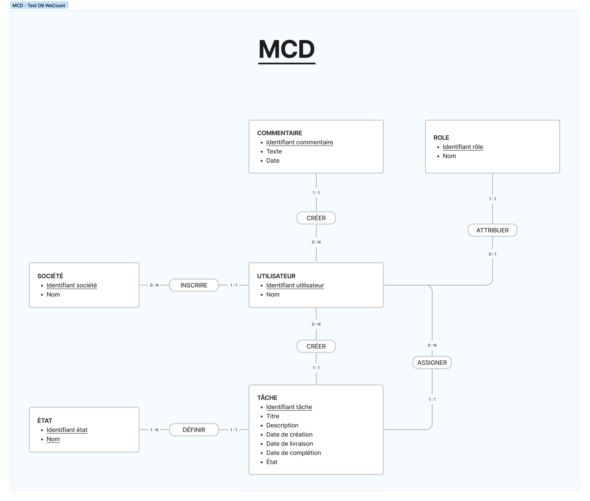

# Premier test développeur FullStack WeCount

## Pour consulter l'intégration

Lancez l'application depuis votre terminal :
- npm i
- npm run dev

L'application écoute localhost:5173

## Pour consulter le test DB (les diagrammes ont été réalisés sur Figma)

- Option 1 : fichiers PDF et JPEG des MCD et MPD
- Option 2 : visualiser les images ci-dessous

### MCD

### MPD

