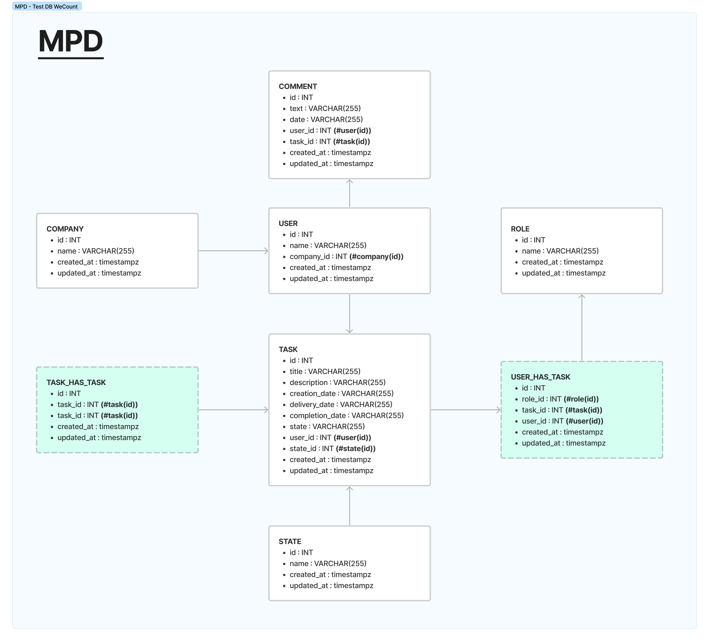

# Premier test développeur FullStack WeCount

## Pour consulter l'intégration

Lancez l'application depuis votre terminal :
- npm i
- npm run dev

L'application écoute localhost:5173

## Pour consulter le test DB (les diagrammes ont été réalisés sur Figma)

- Option 1 : fichiers JPEG des MCD et MPD dans le dossier "DB" du projet
- Option 2 : visualiser les images ci-dessous

### MCD

### MPD

### Représentation des tables de la DB

- company
- user (ref: company_id)
- task
- task has user (ref: role_id, user_id, task_id)
- role
- comment (ref: user_id)
- task has task (pour que les tâches puissent être liées entre elles)